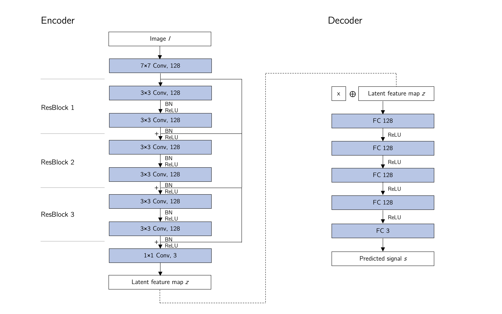
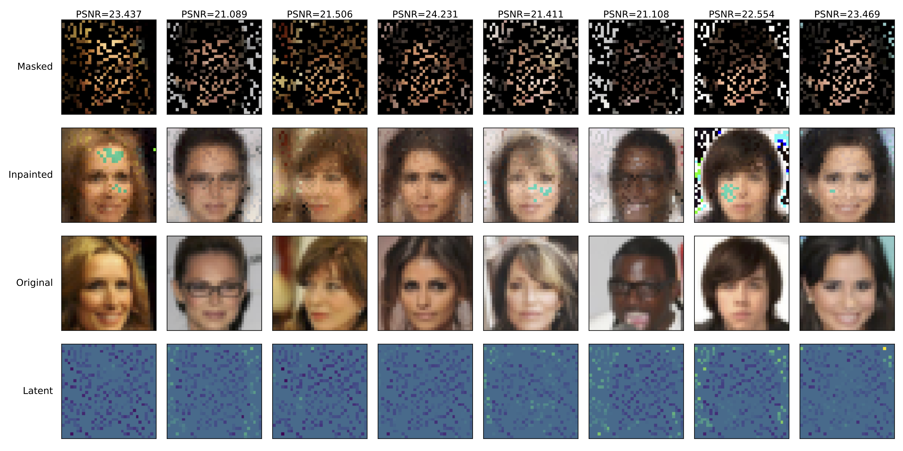

# Implicit Image Inpainting

Image inpainting through implicit neural representations.

See [slides.pdf](./slides.pdf) for more information.

## Architecture

## Results

Random mask, filling rate 0.3:

